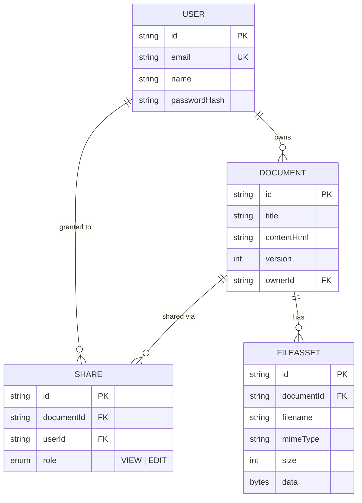
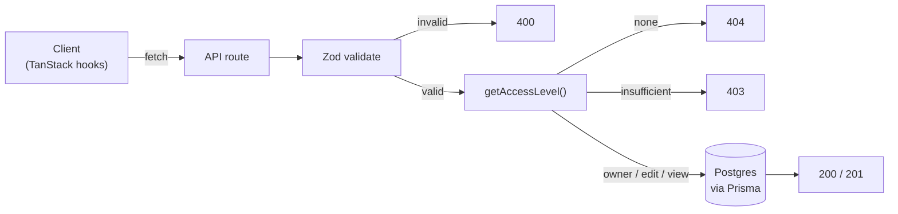
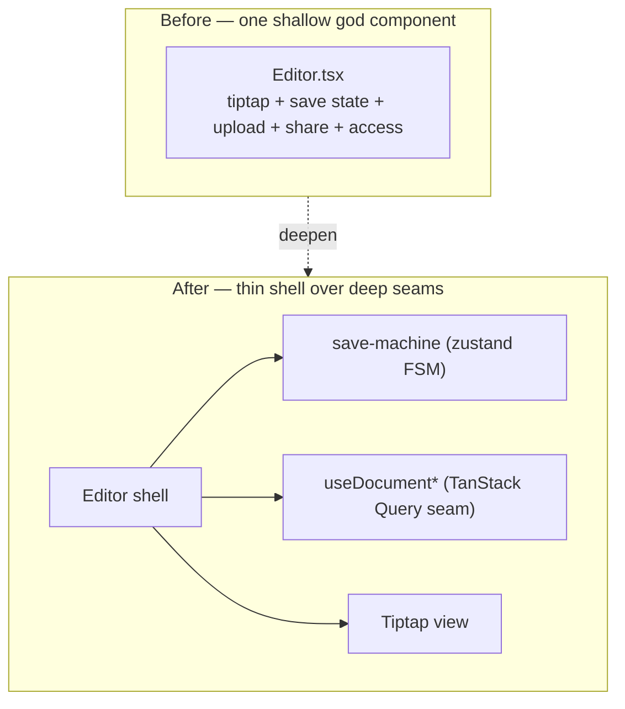

# Architecture & Priorities

## What I optimized for

A 4–6 hour window forces ruthless prioritization. I optimized for a **complete,
correct vertical slice** of every required capability over a polished version of
any one. Each of the five required areas — editing, upload, sharing, persistence,
engineering quality — works end to end with real access control, rather than one
area being deep and another stubbed.

## Stack & why

| Layer        | Choice                          | Why |
|--------------|---------------------------------|-----|
| Framework    | Next.js 16 App Router           | One codebase for UI + API; server components read the session directly, no extra API hop for page loads. |
| Editor       | Tiptap (StarterKit)             | Battle-tested rich-text; emits clean HTML that maps directly to a single persisted column. Formatting "just works" and round-trips. |
| DB / ORM     | Postgres (Neon) + Prisma 7      | Relational model fits documents↔shares↔files cleanly. Neon is serverless-friendly for Vercel. Prisma 7 driver adapter (`@prisma/adapter-pg`) for the runtime connection. |
| Auth         | iron-session + bcrypt           | Stateless encrypted cookie — no auth service to stand up, but real password hashing and httpOnly sessions. |
| Validation   | Zod                             | One schema per endpoint, rejecting bad input at the boundary. |
| Server-state | TanStack Query                  | One seam for all client async — cache, retry, invalidation, and the `refetchInterval` that powers polling. |
| Save machine | Zustand                         | The save lifecycle is an explicit finite state machine, not scattered booleans. |

## Data model



- `Document.contentHtml` — the editor's HTML, **sanitized on write**.
- `Document.version` — integer, incremented on every content write; the basis for optimistic concurrency (below).
- `Share(documentId, userId, role)` — unique per pair; `role ∈ {VIEW, EDIT}`.
- `FileAsset` — file bytes stored in-row (`Bytes`) plus filename/mime/size.

## Access control (the core of "sharing")

A single function, `getAccessLevel(documentId, userId) → owner | edit | view | none`,
is the one place access is decided. Every API route calls it:

- **Read** (GET document, download file, **duplicate**): `owner | edit | view`.
- **Write** (PUT content, upload file): `owner | edit`.
- **Share / unshare / delete**: `owner` only.
- **Leave** (drop your own share): any non-owner grantee.

Centralizing this avoids the classic bug where one endpoint forgets a check.
Non-readable documents return **404, not 403**, so the API doesn't leak which
document IDs exist. The lifecycle actions fall out of the same four levels:
*duplicate* needs only read (copies title, content, and attachments into a new
document you own); *leave* removes your own `Share` row; *delete* is owner-only and
permanent (behind a UI confirm).

Every mutating request runs the same gauntlet:



## Client architecture (save machine · query seam · polling)

The interactive document surface is a thin shell over three seams, not a god
component:



- **Save lifecycle as a finite state machine** (`src/lib/save-machine.ts`). States
  are `clean · dirty · saving · saved · error · conflict`; the pure `nextStatus`
  transition is the test surface (8 unit tests). A small zustand store holds the
  status + version; the `useDocumentSave` hook owns the side effects (debounce,
  network) the machine must not. This replaces the earlier scatter of a status
  string + a timer ref + ad-hoc `setSaveState` calls.

  ```mermaid
  stateDiagram-v2
    [*] --> clean
    clean --> dirty: edit
    dirty --> saving: flush (debounced)
    saving --> saved: saveOk
    saving --> error: saveFail
    saving --> conflict: 409 stale
    saved --> dirty: edit
    error --> saving: retry
    dirty --> conflict: remoteChanged
    conflict --> clean: reload
  ```
- **One TanStack Query seam for server-state** (`src/hooks/documents.ts`). Every
  client read/mutation — document fetch, create, save, upload, share, revoke —
  goes through query/mutation hooks with cache invalidation, replacing hand-rolled
  `fetch` + local `loading/error` booleans. Server components hydrate the query so
  first paint isn't a double-fetch. (Auth stays as direct calls — one-shot
  navigations gain nothing from a cache.)
- **Polling with safe reconciliation** (the collaborative bit). A Document is
  polled (`refetchInterval`) only when it's actually collaborative — shared with
  someone, or you're a grantee. The poll is reconciled against the save machine:
  when `clean`, a newer remote version swaps in silently; when `dirty/saving`, it
  raises the `conflict` state and a "Reload latest" banner instead of clobbering
  your edits.

  ```mermaid
  sequenceDiagram
    participant U as You (shared-edit)
    participant Q as Query (poll 5s / on focus)
    participant API as /api/documents/:id
    Q->>API: GET (poll / focus / reconnect)
    API-->>Q: { content, version }
    alt machine = clean
      Q->>U: swap in remote silently
    else machine = dirty / saving
      Q->>U: "Reload latest" banner (conflict)
    end
    U->>API: PUT { content, lastSeenVersion }
    alt version matches
      API-->>U: 200 saved (version + 1)
    else stale
      API-->>U: 409 -> conflict state
    end
  ```

## Key tradeoffs

- **Files in Postgres, not blob storage.** With a 5 MB cap, storing bytes in-row
  removes an entire external dependency (S3/Vercel Blob + signed URLs) and keeps
  access control trivial — the same `getAccessLevel` guards downloads. At larger
  scale this moves to object storage with pre-signed URLs.
- **Optimistic concurrency, not CRDT.** Each content PUT carries the
  `lastSeenVersion`; the server applies it with a version-guarded `updateMany` and
  returns **409** if a concurrent editor advanced first. The client turns that 409
  into the machine's `conflict` state. This gives real multi-editor safety — no
  silent last-write-wins data loss — without the cost of operational-transform or
  CRDT real-time merge (still out of scope; see below).
- **Sanitize on write, trust on read.** Stored HTML is allowlist-sanitized
  (`sanitize-html`) before persistence, so a shared editor can't plant stored XSS.
- **Roll-your-own auth.** Cheaper than wiring NextAuth for a two-field login, and
  keeps the session readable from server components with one helper.

## Explicitly out of scope (and why)

- **Real-time character-level co-editing** (live cursors / CRDT merge) — high
  effort. Freshness for shared Documents is delivered via polling + optimistic
  concurrency; true conflict-free concurrent typing is the next tier.
- **Email invites for non-registered users** — sharing targets existing accounts;
  an invite flow is additive, not core.
- **Soft-delete / trash** — delete is permanent (behind a confirm).

## Import / export & presentation

- **Import / export** convert through one client util (`src/lib/document-format.ts`):
  Markdown ↔ HTML via `marked`/`turndown`, plain text via Tiptap's own text getter.
  Import either seeds a new document or appends into the open draft; the latter rides
  the same autosave path, so no special persistence code.
- **Design** follows a supplied editorial system (`DESIGN.md`): a near-monochrome
  paper palette, a single display serif, hairline borders, and one electric-violet
  glow used only as focus halos and ambient shadow — never a fill. Tokens live in
  `globals.css` (`@theme`); fonts load via `next/font`.

## Security notes

- Passwords bcrypt-hashed; login returns an identical error for unknown-user vs
  wrong-password.
- Sessions are httpOnly, `secure` in production, `sameSite=lax`.
- All mutations validate input with Zod and re-check access server-side — the UI
  never decides permissions.
- Uploads are type- and size-checked server-side.

## Architecture decisions

Condensed records of the load-bearing decisions (the ones a future change would need
to revisit). The client decisions came out of a deliberate post-MVP deepening pass.

### ADR-1 — Save lifecycle as an explicit finite state machine
**Decision.** Model autosave as `clean · dirty · saving · saved · error · conflict`
in a pure `nextStatus` reducer behind a zustand store; side effects live in the
hook. **Why.** The lifecycle was an implicit machine (a status string + a timer ref +
scattered setters) — the shape couldn't even express "remote changed mid-edit". A
real machine makes the `conflict` state reachable and gives a DOM-free test surface.
**Rejected.** Keeping ad-hoc booleans; they don't compose with polling.

### ADR-2 — One TanStack Query seam for client server-state
**Decision.** Route every document read/mutation through query/mutation hooks with
cache invalidation; hydrate from server components. **Why.** Hand-rolled `fetch` +
`loading/error` booleans drifted against the server-rendered props and gave nowhere
to hang polling. One seam buys cache, retry, dedupe, invalidation, and
`refetchInterval`. **Rejected.** "TanStack for *everything*" — auth is one-shot
navigation, so login/logout stay direct calls. Judgment over dogma.

### ADR-3 — Polling + optimistic concurrency for shared-doc freshness
**Decision.** Poll only collaborative documents (and on focus/reconnect); guard
writes with `version` + a version-checked `updateMany` returning **409**. **Why.** A
shared doc needs to feel live, but a naive `refetchInterval` either clobbers your
in-progress edit or silently overwrites a co-editor (blind last-write-wins). The
version guard turns a clash into a visible `conflict` instead of data loss.
**Rejected.** Naive polling (data-loss hazard) and full CRDT/OT (out of budget).

### ADR-4 — File bytes in Postgres, not blob storage
**Decision.** Store attachments in-row (`Bytes`), ≤5 MB. **Why.** Removes an external
dependency (S3/Blob + signed URLs) and lets the same `getAccessLevel` guard downloads.
**Rejected.** Object storage — correct at scale, overkill here; noted as the next step.

### ADR-5 — One centralized access function; 404 over 403
**Decision.** All routes resolve permission through `getAccessLevel`; non-readable
documents return **404**. **Why.** A single decision point prevents the "one endpoint
forgot a check" bug; 404 avoids leaking which document IDs exist. **Rejected.**
Per-route ad-hoc checks; per-resource 403 (leaks existence).

## Where it goes next

Object storage for large files · soft-delete + trash · share-by-link · presence
and conflict-free real-time editing · rate limiting on auth endpoints.
